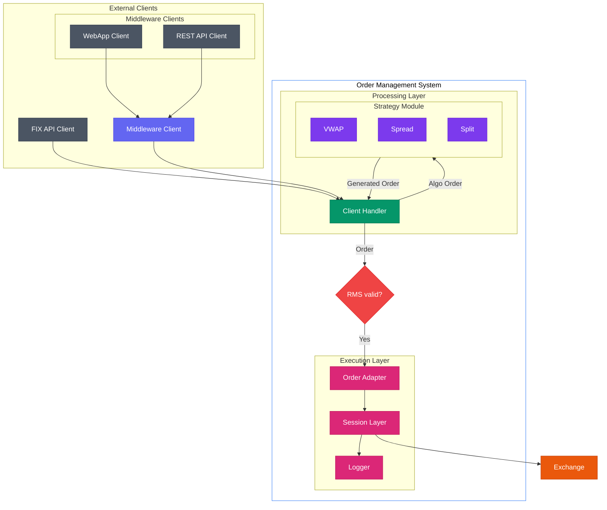

```mermaid
flowchart TB
    %% Client Layer with hierarchy
    subgraph ClientLayer[External Clients]
        FC[FIX API Client]
        
        subgraph MWClients[Middleware Clients]
            direction TB
            WA[WebApp Client]
            RC[REST API Client]
        end
        
        %% Connect both clients to middleware
        WA --> MW[Middleware Client]
        RC --> MW
    end

    %% OMS System boundary
    subgraph OMS[Order Management System]
        direction TB
        
        %% Processing Layer
        subgraph ProcessingLayer[Processing Layer]
            direction LR
            CH[Client Handler]
            subgraph Strategies[Strategy Module]
                direction TB
                VWAP[VWAP]
                SPREAD[Spread]
                SPLIT[Split]
            end
        end

        %% RMS Module
        RMS{RMS valid?}

        %% Execution Layer
        subgraph ExecutionLayer[Execution Layer]
            direction LR
            OA[Order Adapter]
            SL[Session Layer]
            LOG[Logger]
        end
    end

    %% Exchange Layer
    EX[Exchange]

    %% Connections to OMS
    FC --> CH
    MW --> CH
    
    %% Order Processing Flow
    CH --> |Algo Order| Strategies
    Strategies --> |Generated Order| CH
    CH --> |Order| RMS 
    RMS --> |Yes| OA
    
    %% Execution flow
    OA --> SL
    SL --> LOG
    SL --> EX

    %% Styling
    classDef client fill:#4b5563,stroke:#374151,color:white
    classDef middleware fill:#6366f1,stroke:#4f46e5,color:white
    classDef handler fill:#059669,stroke:#047857,color:white
    classDef strategy fill:#7c3aed,stroke:#6d28d9,color:white
    classDef rms fill:#ef4444,stroke:#dc2626,color:white
    classDef execution fill:#db2777,stroke:#be185d,color:white
    classDef exchange fill:#ea580c,stroke:#c2410c,color:white
    classDef decision fill:#eab308,stroke:#ca8a04,color:white
    classDef system fill:none,stroke:#3b82f6,color:black
    classDef tier fill:none,stroke:#64748b,color:black

    class FC,WA,RC client
    class MW middleware
    class CH handler
    class VWAP,SPREAD,SPLIT strategy
    class RMS rms
    class OA,SL,LOG execution
    class EX exchange
    class OMS system
```
